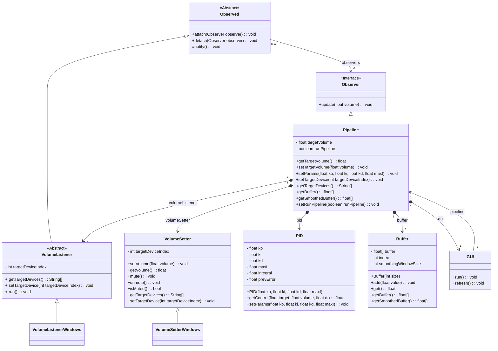

### UML

```mermaid
classDiagram

    class Observer{
        <<Interface>>
        +update(float volume) : void
    }

    class Observed{
        <<Abstract>>
        +attach(Observer observer) : void
        +detach(Observer observer) : void
        #notify() : void
    }

    Observed "0..n" --> "0..n" Observer : observers


    class VolumeListener{
        <<Abstract>>
        - int targetDeviceIndex
        + getTargetDevices() : String[]
        + setTargetDevice(int targetDeviceIndex) : void
        + run() : void
    }

    Observed <|-- VolumeListener

    class VolumeListenerWindows{
    }

    class VolumeSetter{
        - int targetDeviceIndex
        +setVolume(float volume) : void
        +getVolume() : float
        +mute() : void
        +unmute() : void
        +isMuted() : bool
        +getTargetDevices() : String[]
        +setTargetDevice(int targetDeviceIndex) : void
    }

    class VolumeSetterWindows{
    }

    VolumeSetter <|-- VolumeSetterWindows

    VolumeListener <|-- VolumeListenerWindows

    class Pipeline{
        - float targetVolume
        - boolean runPipeline
        +getTargetVolume() : float
        +setTargetVolume(float volume) : void
        +setParams(float kp, float ki, float kd, float maxI) : void
        +setTargetDevice(int targetDeviceIndex) : void
        +getTargetDevices() : String[]
        +getBuffer() : float[]
        +getSmoothedBuffer() : float[]
        +setRunPipeline(boolean runPipeline) : void
    }

    Observer <|-- Pipeline

    class PID{
        - float kp
        - float ki
        - float kd
        - float maxI
        - float integral
        - float prevError
        +PID(float kp, float ki, float kd, float maxI)
        +getControl(float target, float volume, float dt) : float
        +setParams(float kp, float ki, float kd, float maxI) : void
    }

    class Buffer{
        - float[] buffer
        - int index
        - int smoothingWindowSize
        +Buffer(int size)
        +add(float value) : void
        +get() : float
        +getBuffer() : float[]
        +getSmoothedBuffer() : float[]
    }

    class GUI{
        +run() : void
        +refresh() : void
    }

    Pipeline "1" *--> "1" PID : pid
    Pipeline "1" *--> "1" VolumeListener : volumeListener
    Pipeline "1" *--> "1" VolumeSetter : volumeSetter
    Pipeline "1" *--> "1" Buffer : buffer
    Pipeline "1" *--> "1" GUI : gui
    GUI "1" --> "1" Pipeline : pipeline
```
